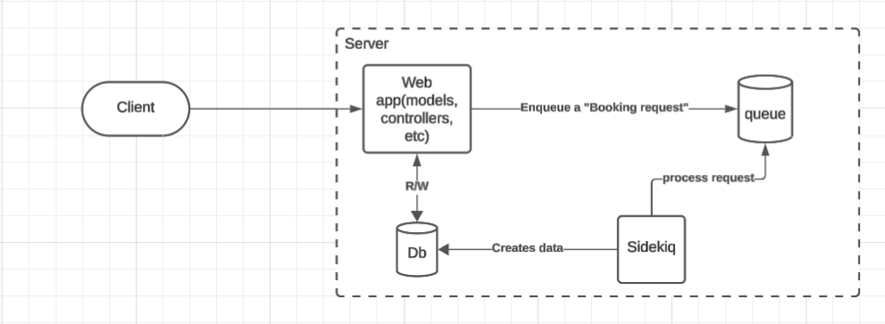
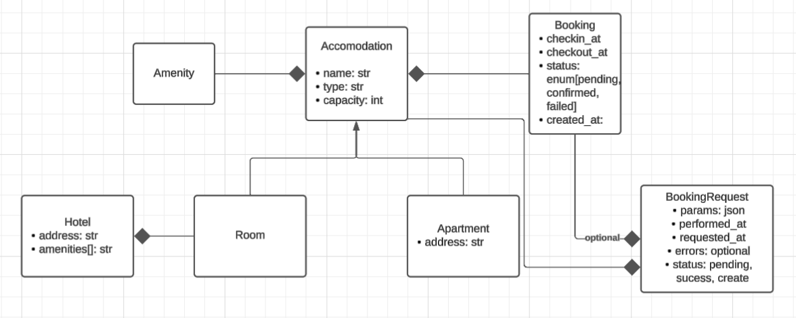
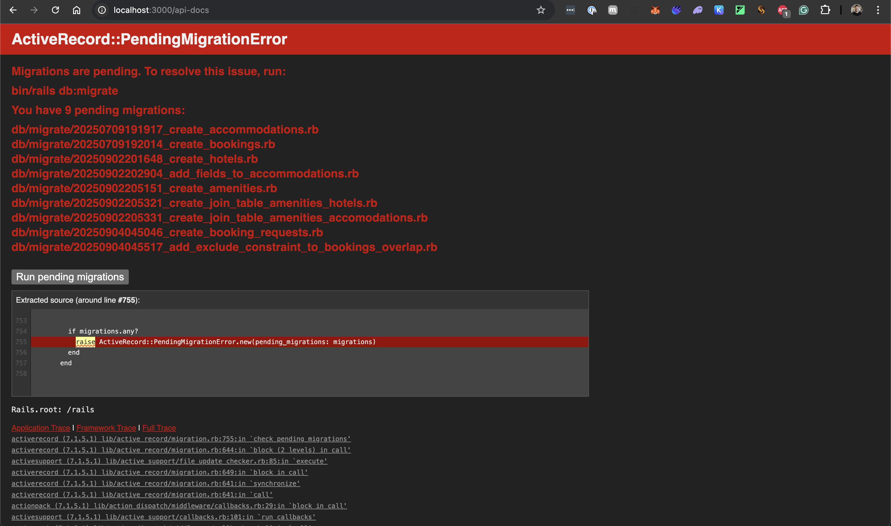
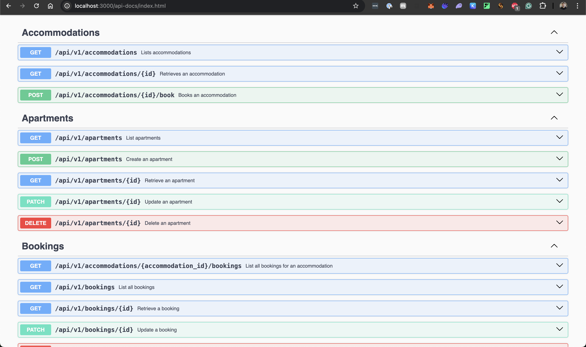
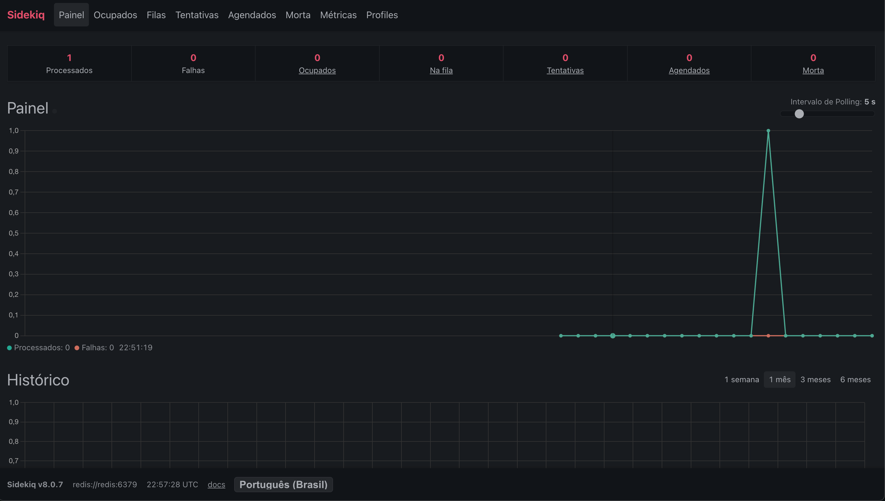

# README

**Required Ruby version: 3.2.2**

A simple Rails API for accommodations and bookings.

## Challenge context

This repository contains a partially implemented accommodations booking REST API, designed as a work-in-progress prototype for a real-world application.

### Submission and workflow/Applications/Visual Studio Code.app
- Host your solution in a cloud git repository of your choice.
- The first commit must:
  - Have the message "First commit"
  - Contain the exact code sample as it was provided, with no changes
- From this point on, work on the problems below as you prefer.

### Problems

Note: Treat each exercise as production-ready work. Solutions should be suitable to ship: designed for stability under realistic usage, correct when multiple clients act at the same time, mindful of scale, and operationally sound (documentation, tests, migration strategy, and maintainability). Avoid toy or purely illustrative implementations.

- **Problem #1 — Entities**
  - There's an `Accommodation` base concept, but the business domain only includes `Hotel` and `Apartment`.
  - Expected: Add these 2 entities and provide endpoints for their management.
  - Production expectation: Deliver an API and data model appropriate for a real system, with attention to interface design, correctness, and long-term maintainability.

- **Problem #2 — Overlapping bookings**
  - Currently, every accommodation can contain several overlapping bookings for the same `start_date` and `end_date`.
  - Expected: Apartments must not allow overlapping bookings during the same period. Hotels should allow overlapping bookings for the same period (different rooms booked simultaneously).
  - Production expectation: Ensure the approach remains correct under concurrent access and when requests may be retried. Favor solutions that provide clear guarantees and are observable in operation.

- **Problem #3 — Next available date**
  - Given an accommodation `id` and a `date`, retrieve the next available date for that accommodation.
  - Questions to address:
    - Explain the client-facing contract you would establish with the frontend team to consume this capability.
    - Explain the algorithm you would use to solve this problem.

## Tech context

- **Stack**: Ruby on Rails (API), Active Record (PostgreSQL), Rswag for Swagger docs.
- **Docs**: Interactive API docs served at `/api-docs` when the server is running.

## What we assess
- Architecture and data modeling suitable for long-term evolution
- Correctness when multiple clients act concurrently and safe handling of request retries
- Performance characteristics and sensible use of database capabilities
- API design quality, documentation, and versioning discipline
- Testing depth that exercises critical behaviors and edge cases
- Operational readiness: migrations, observability, error handling, and maintainability

## API overview

- Explore and try the endpoints in Swagger: `http://localhost:3000/api-docs/index.html`.

### Prerequisites
- Ruby 3.2.2 and Bundler
- Docker and Docker Compose

No local PostgreSQL installation is required; the database runs in Docker.

### Run modes

#### Mode A: Local Rails + Dockerized Postgres
Use Docker only for the database; run Rails on your host.

1. Start the database:
   ```sh
   docker compose up -d db
   ```
2. Install gems (host):
   ```sh
   bundle install
   ```
3. Prepare the database (create + migrate):
   ```sh
   bundle exec rails db:prepare
   # optional sample data
   bundle exec rails db:seed
   ```
4. Start Rails (host):
   ```sh
   bundle exec rails s
   ```
5. Open API docs: `http://localhost:3000/api-docs/index.html`

Notes:
- `config/database.yml` is set to connect to `localhost:5432` with `postgres/postgres` for development/test.
- If you previously exported `DATABASE_URL` in your shell, unset it to avoid overrides: `unset DATABASE_URL`.

#### Mode B: Full Docker (web + db)
Run both the app and database in containers.

1. Build images:
   ```sh
   docker compose build
   ```
2. Start services:
   ```sh
   docker compose up
   ```
   The entrypoint automatically runs `rails db:prepare` on startup.
3. (Optional) Seed sample data:
   ```sh
   docker compose run --rm web bundle exec rails db:seed
   ```
4. App URL: `http://localhost:3000`
5. API docs: `http://localhost:3000/api-docs/index.html`

### Running tests
- Host (Mode A):
  ```sh
  bundle exec rspec
  ```
- Docker (Mode B):
  ```sh
  docker compose run --rm web bundle exec rspec
  ```

### Helpful commands
- Reset DB (drop, create, migrate, seed) on host:
  ```sh
  bundle exec rails db:reset && bundle exec rails db:seed
  ```
- Verify DB readiness (Docker DB):
  ```sh
  docker compose exec db pg_isready -U postgres -h localhost -p 5432
  ```

---
If something doesn’t work, confirm your Ruby version matches `.ruby-version`, Docker is running, and that the DB container is up (`docker compose ps`).


## Solution

To solve this challenge, I was inspired in the approach the top-tier booking products(airbnb, booking.com, etc) use: an async booking system. But in that case a simpler and rails-like way.
For this, I decided to add an action to create the BookingRequest and then, we have a Sidekiq worker being trigger as a queue, considering the accommodation_id as the unique key.

If everything went fine(e.g.: checks for overlap), we create the actual Booking and change the BookingRequest.status to sucess, otherwise we change the BookingRequest.status to failed.




To reach this, I followed the model architecture below





### Running the project
To run the project you just need to have docker setup locally in your environment. Then you will be able to run the project by running

```bash
docker compose up -d --build
[+] Running 24/24
 ✔ db Pulled                                                                                                       8.3s 
   ✔ 09e80d3089d1 Download complete                                                                                0.9s 
   ✔ 2bd40904509c Download complete                                                                                0.8s 
   (...)
   ✔ 5a536616970a Download complete                                                                                0.4s 
 ✔ redis Pulled                                                                                                    5.0s 
   ✔ ec7ed15a85c2 Download complete                                                                                0.9s 
   ✔ 92b33cc1d06d Download complete                                                                                0.7s 
   (...)
   ✔ c843e90a254e Download complete                                                                                0.8s 
[+] Building 29.2s (33/33) FINISHED                                                                docker:desktop-linux
 => [web internal] load build definition from Dockerfile                                                           0.0s
 => => transferring dockerfile: 1.89kB                                                                             0.0s
 => [sidekiq] resolve image config for docker-image://docker.io/docker/dockerfile:1                                1.5s
 => CACHED [sidekiq] docker-image://docker.io/docker/dockerfile:1@sha256:38387523653efa0039f8e1c89bb74a30504e76ee  0.0s
 => => resolve docker.io/docker/dockerfile:1@sha256:38387523653efa0039f8e1c89bb74a30504e76ee9f565e25c9a09841f9427  0.0s
 => [web internal] load build definition from Dockerfile                                                           0.0s
 => WARN: FromAsCasing: 'as' and 'FROM' keywords' casing do not match (line 5)                                     0.0s
 => WARN: FromAsCasing: 'as' and 'FROM' keywords' casing do not match (line 18)                                    0.0s
 => [sidekiq internal] load metadata for registry.docker.com/library/ruby:3.2.2-slim                               1.6s
 => [web internal] load .dockerignore                                                                              0.0s
 => => transferring context: 697B                                                                                  0.0s
 => [web internal] load build context                                                                              0.3s
 => => transferring context: 653.07kB                                                                              0.2s
(...)
 => => exporting attestation manifest sha256:5c794360854af68bc65d06529b71ef705e03515fa376d1a4a16f7e49feb9cfc5      0.0s
 => => exporting manifest list sha256:37c3da7b7db90969fe9a05c0dcaf176d2386944bdd402a63c74d4bfc9098e1a2             0.0s
 => => naming to docker.io/library/ror-tech-challenge-to-send-sidekiq:latest                                       0.0s
 => => unpacking to docker.io/library/ror-tech-challenge-to-send-sidekiq:latest                                    0.0s
 => [sidekiq] resolving provenance for metadata file                                                               0.0s
[+] Running 7/7
 ✔ Network ror-tech-challenge-to-send_default      Created                                                         0.0s 
 ✔ Volume "ror-tech-challenge-to-send_db_data"     Created                                                         0.0s 
 ✔ Volume "ror-tech-challenge-to-send_redis_data"  Created                                                         0.0s 
 ✔ Container ror-tech-challenge-to-send-db-1       Started                                                         0.2s 
 ✔ Container ror-tech-challenge-to-send-redis-1    Started                                                         0.2s 
 ✔ Container ror-tech-challenge-to-send-web-1      Started                                                         0.3s 
 ✔ Container ror-tech-challenge-to-send-sidekiq-1  Started
```

Now you will be able to see the running containers by running

```bash
❯ docker compose ps
NAME                                   IMAGE                                COMMAND                  SERVICE   CREATED         STATUS         PORTS
ror-tech-challenge-to-send-db-1        postgres:15                          "docker-entrypoint.s…"   db        2 minutes ago   Up 2 minutes   0.0.0.0:5432->5432/tcp
ror-tech-challenge-to-send-redis-1     redis:7-alpine                       "docker-entrypoint.s…"   redis     2 minutes ago   Up 2 minutes   0.0.0.0:6379->6379/tcp
ror-tech-challenge-to-send-sidekiq-1   ror-tech-challenge-to-send-sidekiq   "/rails/bin/docker-e…"   sidekiq   2 minutes ago   Up 2 minutes   3000/tcp
ror-tech-challenge-to-send-web-1       ror-tech-challenge-to-send-web       "/rails/bin/docker-e…"   web       2 minutes ago   Up 2 minutes   0.0.0.0:3000->3000/tcp
```


At this point, you will not be able to use the app yet, since there are pending migrations for it



But we cam fix it by running the following command

```bash
❯ docker compose exec web bin/rails db:migrate
DEPRECATION WARNING: Rswag::Ui: WARNING: The method will be renamed to "openapi_endpoint" in v3.0 (called from block in <main> at /rails/config/initializers/rswag_ui.rb:12)
== 20250709191917 CreateAccommodations: migrating =============================
-- create_table(:accommodations)
   -> 0.0037s
== 20250709191917 CreateAccommodations: migrated (0.0037s) ====================

== 20250709192014 CreateBookings: migrating ===================================
-- create_table(:bookings)
   -> 0.0040s
== 20250709192014 CreateBookings: migrated (0.0040s) ==========================

== 20250902201648 CreateHotels: migrating =====================================
-- create_table(:hotels)
   -> 0.0025s
== 20250902201648 CreateHotels: migrated (0.0025s) ============================

== 20250902202904 AddFieldsToAccommodations: migrating ========================
-- add_column(:accommodations, :type, :string)
   -> 0.0011s
-- add_column(:accommodations, :capacity, :integer)
   -> 0.0004s
-- add_column(:accommodations, :address, :string)
   -> 0.0004s
-- add_reference(:accommodations, :hotel, {:null=>true, :foreign_key=>true})
   -> 0.0025s
== 20250902202904 AddFieldsToAccommodations: migrated (0.0046s) ===============

== 20250902205151 CreateAmenities: migrating ==================================
-- create_table(:amenities)
   -> 0.0021s
-- add_index(:amenities, :name, {:unique=>true})
   -> 0.0017s
== 20250902205151 CreateAmenities: migrated (0.0039s) =========================

== 20250902205321 CreateJoinTableAmenitiesHotels: migrating ===================
-- create_join_table(:amenities, :hotels)
   -> 0.0040s
== 20250902205321 CreateJoinTableAmenitiesHotels: migrated (0.0040s) ==========

== 20250902205331 CreateJoinTableAmenitiesAccomodations: migrating ============
-- create_table(:accommodations_amenities, {:id=>false})
   -> 0.0016s
-- add_index(:accommodations_amenities, [:accommodation_id, :amenity_id], {:unique=>true})
   -> 0.0010s
-- add_index(:accommodations_amenities, [:amenity_id, :accommodation_id], {:unique=>true})
   -> 0.0012s
== 20250902205331 CreateJoinTableAmenitiesAccomodations: migrated (0.0039s) ===

== 20250904045046 CreateBookingRequests: migrating ============================
-- create_table(:booking_requests)
   -> 0.0063s
== 20250904045046 CreateBookingRequests: migrated (0.0063s) ===================

== 20250904045517 AddExcludeConstraintToBookingsOverlap: migrating ============
-- enable_extension("btree_gist")
   -> 0.0161s
-- execute("      ALTER TABLE bookings\n      ADD CONSTRAINT bookings_no_overlap EXCLUDE USING gist\n      (\n        accommodation_id WITH =,\n        daterange(start_date, end_date, '[]') WITH &&\n      );\n")
   -> 0.0010s
== 20250904045517 AddExcludeConstraintToBookingsOverlap: migrated (0.0172s) ===
``` 

Then when you refresh the browser, you can now access the Swagger API docs




#### Managing the entities

We can levarage that managing by using the API v1, all the entities described in the model architecture section are managed. We can, for instance:

Get hotels/apartments from the API

```bash
❯ curl -s localhost:3000/api/v1/hotels/ | jq
{
  "hotels": [],
  "meta": {
    "current_page": 1,
    "total_pages": 0,
    "total_count": 0
  }
}
```

We can also create hotels


```bash
curl -X POST http://localhost:3000/api/v1/hotels \
-H "Content-Type: application/json" \
-d '{
  "hotel": {
    "name": "Hotel Paradise",
    "description": "A beautiful place to stay",
    "price": 250.00,
    "location": "Beachside",
    "capacity": 100,
    "address": "123 Ocean Drive",
    "amenities_attributes": [
      { "name": "Pool" },
      { "name": "Gym" }
    ],
    "rooms_attributes": [
      {
        "name": "Room 1",
        "description": "Sea view, king bed",
        "price": 150.00,
        "location": "First floor",
        "capacity": 2,
        "address": "Room 1, First floor",
        "amenities_attributes": [
          { "name": "WiFi" },
          { "name": "Air Conditioning" }
        ]
      },
      {
        "name": "Room 2",
        "description": "Garden view, queen bed",
        "price": 140.00,
        "location": "Second floor",
        "capacity": 2,
        "address": "Room 2, Second floor",
        "amenities_attributes": [
          { "name": "WiFi" }
        ]
      },
      {
        "name": "Room 3",
        "description": "City view, two single beds",
        "price": 130.00,
        "location": "Third floor",
        "capacity": 2,
        "address": "Room 3, Third floor",
        "amenities_attributes": []
      },
      {
        "name": "Room 4",
        "description": "Suite with balcony",
        "price": 200.00,
        "location": "Top floor",
        "capacity": 4,
        "address": "Room 4, Top floor",
        "amenities_attributes": [
          { "name": "Minibar" },
          { "name": "Jacuzzi" }
        ]
      },
      {
        "name": "Room 5",
        "description": "Standard room",
        "price": 120.00,
        "location": "First floor",
        "capacity": 2,
        "address": "Room 5, First floor",
        "amenities_attributes": []
      }
    ]
  }
}' | jq

{
  "hotel": {
    "id": 1,
    "name": "Hotel Paradise",
    "address": "123 Ocean Drive",
    "created_at": "2025-09-05T22:31:12.701Z",
    "updated_at": "2025-09-05T22:31:12.701Z",
    "amenities": [
      {
        "name": "Pool"
      },
      {
        "name": "Gym"
      }
    ]
  }
}

❯ curl -s localhost:3000/api/v1/hotels/ | jq
{
  "hotels": [
    {
      "id": 1,
      "name": "Hotel Paradise",
      "address": "123 Ocean Drive",
      "created_at": "2025-09-05T22:31:12.701Z",
      "updated_at": "2025-09-05T22:31:12.701Z",
      "amenities": [
        {
          "name": "Pool"
        },
        {
          "name": "Gym"
        }
      ]
    }
  ],
  "meta": {
    "current_page": 1,
    "total_pages": 1,
    "total_count": 1
  }
}
```

Also we can create apartments

```bash
curl -X POST http://localhost:3000/api/v1/apartments \
-H "Content-Type: application/json" \
-d '{
  "apartment": {
    "name": "Sea View Apartment",
    "description": "Furnished apartment with ocean view and pool access.",
    "price": 420.0,
    "location": "Main Avenue, Central Beach",
    "address": "Main Avenue, 999",
    "amenities_attributes": [
      { "name": "Air Conditioning" },
      { "name": "Pool" },
      { "name": "WiFi" }
    ]
  }
}' | jq

{
  "apartment": {
    "id": 6,
    "name": "Sea View Apartment",
    "description": "Furnished apartment with ocean view and pool access.",
    "price": "420.0",
    "location": "Main Avenue, Central Beach",
    "capacity": null,
    "address": "Main Avenue, 999",
    "created_at": "2025-09-05T22:34:28.001Z",
    "updated_at": "2025-09-05T22:34:28.001Z",
    "amenities": [
      {
        "name": "Air Conditioning"
      },
      {
        "name": "Pool"
      },
      {
        "name": "WiFi"
      }
    ]
  }
}

❯  curl -s localhost:3000/api/v1/apartments | jq
{
  "apartments": [
    {
      "id": 6,
      "name": "Sea View Apartment",
      "description": "Furnished apartment with ocean view and pool access.",
      "price": "420.0",
      "location": "Main Avenue, Central Beach",
      "capacity": null,
      "address": "Main Avenue, 999",
      "created_at": "2025-09-05T22:34:28.001Z",
      "updated_at": "2025-09-05T22:34:28.001Z",
      "amenities": [
        {
          "name": "WiFi"
        },
        {
          "name": "Air Conditioning"
        },
        {
          "name": "Pool"
        }
      ]
    }
  ],
  "meta": {
    "current_page": 1,
    "total_pages": 1,
    "total_count": 1
  }
}
```

We can get all rooms for the created hotel

```bash
❯ curl -s localhost:3000/api/v1/hotels | jq
{
  "hotels": [
    {
      "id": 1,
      "name": "Hotel Paradise",
      "address": "123 Ocean Drive",
      "created_at": "2025-09-05T22:31:12.701Z",
      "updated_at": "2025-09-05T22:31:12.701Z",
      "amenities": [
╰─❯ curl -s localhost:3000/api/v1/hotels/1/rooms | jq
{
  "rooms": [
    {
      "id": 1,
      "name": "Room 1",
      "description": "Sea view, king bed",
      "price": "150.0",
      "location": "First floor",
      "capacity": 2,
      "address": "Room 1, First floor",
      "created_at": "2025-09-05T22:31:12.703Z",
      "updated_at": "2025-09-05T22:31:12.703Z",
      "amenities": [
        {
          "name": "WiFi"
        },
        {
          "name": "Air Conditioning"
        }
      ]
    },
    {
      "id": 2,
      "name": "Room 2",
      "description": "Garden view, queen bed",
      "price": "140.0",
      "location": "Second floor",
      "capacity": 2,
      "address": "Room 2, Second floor",
      "created_at": "2025-09-05T22:31:12.706Z",
      "updated_at": "2025-09-05T22:31:12.706Z",
      "amenities": [
        {
          "name": "WiFi"
        }
      ]
    },
    {
      "id": 3,
      "name": "Room 3",
      "description": "City view, two single beds",
      "price": "130.0",
      "location": "Third floor",
      "capacity": 2,
      "address": "Room 3, Third floor",
      "created_at": "2025-09-05T22:31:12.708Z",
      "updated_at": "2025-09-05T22:31:12.708Z",
      "amenities": []
    },
    {
      "id": 4,
      "name": "Room 4",
      "description": "Suite with balcony",
      "price": "200.0",
      "location": "Top floor",
      "capacity": 4,
      "address": "Room 4, Top floor",
      "created_at": "2025-09-05T22:31:12.709Z",
      "updated_at": "2025-09-05T22:31:12.709Z",
      "amenities": [
        {
          "name": "Minibar"
        },
        {
          "name": "Jacuzzi"
        }
      ]
    },
    {
      "id": 5,
      "name": "Room 5",
      "description": "Standard room",
      "price": "120.0",
      "location": "First floor",
      "capacity": 2,
      "address": "Room 5, First floor",
      "created_at": "2025-09-05T22:31:12.711Z",
      "updated_at": "2025-09-05T22:31:12.711Z",
      "amenities": []
    }
  ],
  "meta": {
    "current_page": 1,
    "total_pages": 1,
    "total_count": 5
  }
}
```

And if we want, you can add a new one

```bash
❯ curl -X POST http://localhost:3000/api/v1/hotels/1/rooms \
        -H "Content-Type: application/json" \
        -d '{
      "room": {
        "name": "Room 101",
        "description": "Ocean view, double bed",
        "price": 180.0,
        "location": "First floor",
        "capacity": 2,
        "address": "Room 101, First floor",
        "amenities_attributes": [
          { "name": "WiFi" },
          { "name": "Air Conditioning" }
        ]
      }
    }' | jq

    {
  "room": {
    "id": 7,
    "name": "Room 101",
    "description": "Ocean view, double bed",
    "price": "180.0",
    "location": "First floor",
    "capacity": 2,
    "address": "Room 101, First floor",
    "created_at": "2025-09-05T22:40:49.433Z",
    "updated_at": "2025-09-05T22:40:49.433Z",
    "amenities": [
      {
        "name": "WiFi"
      },
      {
        "name": "Air Conditioning"
      }
    ]
  }
}
```

In the same way, we can delete and patch rooms, apartments or hotels if we want. For that, we just need to take a look in the swagger documentation accessed by http://localhost:3000/api-docs/index.html .


#### Booking rooms or apartments

As I illustrate in the model architecture, I decided to have the accomodation model as the base class for the Apartment and the Room(instead of the Hotel, which the rooms belong to). Then we can make Booking relates directly to Accommmodation, making the Room and Apartment behaves like the same in the Booking perspective.

I also decided to have a async booking approach, as I illustrated in the macro architecture: Instead of we booking directly the Accommodation, we POST a book intention(BookRequest) in which will be asynchronously processed by sidekiq queues, and if the booking dates don't overlap the already created one, we consolidate the BookingReqeust in an actual Booking and change its status.

> Future work: We can, for instance have a notification feature to notify guests when the booking fails or succeed.


##### Creating the booking

For that, we have an API under the accomodation in which receives the accomodation id(both room or apartment should work)

```bash

❯ curl -X POST http://localhost:3000/api/v1/accommodations/1/book \
        -H "Content-Type: application/json" \
        -d '{
      "start_date": "2025-09-10",
      "end_date": "2025-09-12",
      "guest_name": "John Doe"
    }' | jq

{
  "message": "Booking request created",
  "booking_request_id": 1
}
```

And then we can right after see the status for this request

```bash
❯ curl -s localhost:3000/api/v1/workflow/booking_requests | jq
{
  "workflow/booking_requests": [
    {
      "id": 1,
      "status": "success",
      "accommodation_id": 1,
      "params": {
        "start_date": "2025-09-10",
        "end_date": "2025-09-12",
        "guest_name": "John Doe"
      }
    }
  ],
  "meta": {
    "current_page": 1,
    "total_pages": 1,
    "total_count": 1
  }
}
```


As you can see here the sidekiq have received the request to process the request and it was sucessfully processed





And then we can see the Booking created sucessfully for this accomodation

```bash
❯ curl -s localhost:3000/api/v1/accommodations/1/bookings | jq
{
  "bookings": [
    {
      "id": 1,
      "accommodation_id": 1,
      "accommodation_name": "Room 1",
      "start_date": "2025-09-10",
      "end_date": "2025-09-12",
      "guest_name": "John Doe"
    }
  ],
  "meta": {
    "current_page": 1,
    "total_pages": 1,
    "total_count": 1
  }
}
```

#### Trying to break the system(overrlap)

Let's try to create a booking request to the same accomodation but now overlapping both the start or end date

```bash
❯ curl -s -X POST http://localhost:3000/api/v1/accommodations/1/book \
        -H "Content-Type: application/json" \
        -d '{
      "start_date": "2025-09-11",
      "end_date": "2025-09-12",
      "guest_name": "John Doe"
    }'
{
  "message": "Booking request created",
  "booking_request_id": 2
}
```

We can see that the booking request has been failed:
```bash
❯ curl -s localhost:3000/api/v1/workflow/booking_requests/3 | jq
{
  "workflow/booking_request": {
    "id": 3,
    "status": "failed",
    "accommodation_id": 1,
    "params": {
      "start_date": "2025-09-11",
      "end_date": "2025-09-12",
      "guest_name": "John Doe"
    }
  }
}
```

And now if we do the same for the end_date

```bash
❯ curl -s -X POST http://localhost:3000/api/v1/accommodations/1/book \
        -H "Content-Type: application/json" \
        -d '{
      "start_date": "2025-09-05",
      "end_date": "2025-09-11",
      "guest_name": "John Doe"
    }'
{
  "message": "Booking request created",
  "booking_request_id": 3
}
❯ curl -s localhost:3000/api/v1/workflow/booking_requests/4 | jq
{
  "workflow/booking_request": {
    "id": 3,
    "status": "failed",
    "accommodation_id": 1,
    "params": {
      "start_date": "2025-09-05",
      "end_date": "2025-09-11",
      "guest_name": "John Doe"
    }
  }
}
```


#### Running tests

For running tests you can just 

```bash
❯ bundle install
Bundle complete! 19 Gemfile dependencies, 102 gems now installed.
Use `bundle info [gemname]` to see where a bundled gem is installed.
1 installed gem you directly depend on is looking for funding.
  Run `bundle fund` for details
╰─❯ rails db:create
DEPRECATION WARNING: Rswag::Ui: WARNING: The method will be renamed to "openapi_endpoint" in v3.0 (called from block in <main> at /Users/walteraa/Workspace/ror-tech-challenge-to-send/config/initializers/rswag_ui.rb:12)
Database 'bookings_app_development' already exists
Database 'bookings_app_test' already exists
╰─❯ bundle exec rspec
DEPRECATION WARNING: Rswag::Ui: WARNING: The method will be renamed to "openapi_endpoint" in v3.0 (called from block in <main> at /Users/walteraa/Workspace/ror-tech-challenge-to-send/config/initializers/rswag_ui.rb:12)
/Users/walteraa/.rbenv/versions/3.2.2/lib/ruby/gems/3.2.0/gems/activerecord-7.1.5.1/lib/active_record/associations.rb:2080: warning: already initialized constant Hotel::HABTM_Amenities
/Users/walteraa/.rbenv/versions/3.2.2/lib/ruby/gems/3.2.0/gems/activerecord-7.1.5.1/lib/active_record/associations.rb:2080: warning: previous definition of HABTM_Amenities was here
............................................INFO  2025-09-05T23:47:22.742Z pid=73294 tid=1hpu: Sidekiq 8.0.7 connecting to Redis with options {:size=>10, :pool_name=>"internal", :url=>"redis://localhost:6379/0"}
.........................................

Finished in 0.60018 seconds (files took 0.79719 seconds to load)
85 examples, 0 failures

Coverage report generated for RSpec to /Users/walteraa/Workspace/ror-tech-challenge-to-send/coverage.
Line Coverage: 100.0% (265 / 265)
```

As you can see, we reached 100% of coverage :)
